# ccwatermelon

A Claude Code statusline: a 3-line dashboard, watermelon palette, rendered in about 40ms end to end, Bun startup included.

Green rind while there is room left, red flesh when there isn't: the fruit's own gradient happens to be exactly the semantics a pressure gauge needs.



One session, from the first prompt to the limit. The mood turns, the gauges fill and change colour, the cost crosses its milestones, and when a threshold is passed a 4th line says what is about to happen and when.

Every preview on this page is drawn by the real renderer (`bun run previews`). Nerd Font icons are left out of them, since a browser does not have the font.

## Make it yours



A theme, your own colours, segments switched on, off or moved to the other line, stricter alerts: one JSONC file, per user or per project. The line above each preview is the config that produced it.



As the terminal narrows, the least important segments leave first, the two quotas split into two aligned rows that shed the same column together (clock, then projection, then countdown), long names are cut with an ellipsis, and the 7-day quota never leaves.



`bun run config` opens the editor: every key press redraws the real status line above the list. `w` plays the width sweep and `p` the pressure sweep, so you see what a priority or a threshold does before saving it.

## Reading the gauges

```
(◉_◉) acme-web · main* · Opus 4.7 · conv 72%⡟ ↓52k
🍉 5h 78%⡟ ↺50m (14:50) end 94% · 7d 64%⡏ ↺1d23h (Sat 13:18) end 89%
```

The conversation gauge sits next to the model it belongs to. The two quotas share one line while it fits. When it does not, each gets its own row and the rows share their columns, so the figures read down as well as across:

```
🍉 5h 78%⡟ ↺50m   (14:50)     end 94%
⠀⠀ 7d 64%⡏ ↺1d23h (Sat 13:18) end 89%
```

- `conv 72% ↓52k`: the conversation is at 72% of the compaction threshold, 52k tokens before Claude Code compacts it. Past the threshold it reads `+272k`, the amount already over.
- `5h 78%` and `7d 64%`: how much of each rate-limit window is used.
- `↺50m (14:50)`: the window resets in 50 minutes, at 14:50 local time. Past a day it counts in days and names the weekday, under five minutes it counts in seconds (`↺4m32s`).
- `end 94%`: where the window will stand at its reset if you keep the average pace you have had since it opened. Under 100% you make it to the reset. It turns peach from 85%, and red over 100%, when you will be blocked before the reset.
- `⚠ limit in 35m`: at the pace of the last minutes the 5h quota runs out before it resets. It appears right after the 5h quota, only when that is the case.

## Requirements

- **Bun** (runtime, no other one is supported; CI runs the version in `.bun-version`)
- **A truecolor terminal** (24-bit ANSI), no 256-color fallback, the palette is sent as raw RGB
- **A patched Nerd Font** installed in the terminal, for the cost and lines-changed icons
- `git` on `PATH` (optional: without it, the branch segment simply shows `no-git`)

## Installation

```bash
git clone https://github.com/axelhamil/ccwatermelon.git ~/.claude/scripts/ccwatermelon
cd ~/.claude/scripts/ccwatermelon
bun install
```

Any directory works, just keep the path in `statusLine.command` below in sync.

In `~/.claude/settings.json`:

```json
{
  "statusLine": {
    "type": "command",
    "command": "bun ~/.claude/scripts/ccwatermelon/src/index.ts",
    "padding": 0,
    "refreshInterval": 1
  },
  "subagentStatusLine": {
    "type": "command",
    "command": "bun ~/.claude/scripts/ccwatermelon/src/subagents.ts"
  }
}
```

Both extras are optional:

- `refreshInterval` re-runs the line every second on top of Claude Code's own events. Countdowns tick, a gauge past its threshold pulses and the gradients drift without waiting for the next message. Leave it out and the line only moves when Claude Code redraws, at no idle cost.
- `subagentStatusLine` draws the row of each running subagent in the same palette: status, name, model, tokens with their recent trend, elapsed time and task, aligned in columns.

```
⠋ explorer            haiku 4.5   48k  ⣀⣠⣤⣴⣶⣶⣿⣿   3m  Map every caller of the billing webhook handl…
✓ feature-dev:code-…  opus 4.5   131k    ⢀⣠⣤⣶⣿⣿  10m  Review the retry policy diff
✗ docs                sonnet      920         ⣸   4m  Read the Stripe idempotency key documentation
```

The directory, the branch and the pull request are clickable links (OSC 8) in terminals that support them, such as Kitty, WezTerm or iTerm2. If they show but do not open, start Claude Code with `FORCE_HYPERLINK=1`. Turn them off with the `links` segment.

On first run, if data still exists at the old location
(`~/.local/share/ccstatusline-godlike/` or `~/.local/share/statusline-godlike/`,
under the project's former names), it
is moved automatically to `~/.local/share/ccwatermelon/` with no
loss, real cost history is preserved.

## Segments

| Segment | Line | Default | Why |
|---|---|---|---|
| `mood` | 1 | always on | ASCII mood that reacts to context, cost, and quotas, the first warning signal, before you even read a number |
| `dir` / `git` / `model` | 1 | always on | identity: directory, branch + diff (`+ins -del`), active model, the essential baseline |
| `pullRequest` | 1 | on, silent if absent | the open pull request of the branch and its review state: `#128 ✓` approved, `●` pending, `✗` changes requested, `◌` draft |
| `effort` | 1 | on, silent if absent | reasoning effort of the session (`high`, `xhigh`...), right after the model |
| `fastMode` | 1 | on, silent if off | `↯fast` while fast mode is on |
| `thinking` | 1 | **off** | `✦` while extended thinking is on |
| `motion` | all | on | everything that moves with the clock: blink, travelling separator, pulse, flicker, gradient drift. Switch it off for a still line |
| `links` | 1 | on | makes directory, branch and pull request clickable, switch it off if your terminal prints the escape codes |
| `sessions` | 1 | on | number of Claude Code sessions seen on this project in the last 5 minutes (shown only if >1), so you don't step on your own toes across tabs |
| `night` | 1 | on | `☾` between 1am and 5am local time, a quiet reminder that it's late |
| `worktree` | 1 | on, silent if absent | current git worktree name (`workspace.git_worktree`), useful in multi-branch dev |
| `vimMode` | 1 | on, silent if absent | current vim mode (`vim.mode`), only if the hook provides it |
| `agentName` | 1 | on, silent if absent | name of the active sub-agent (`agent.name`) |
| `outputStyle` | 1 | on, hidden if "default" | current output style, only if it differs from the default |
| `sessionName` | 1 | **off** | Claude Code session name, noisy by default (often auto-generated), enable if useful |
| `ccVersion` | 1 | **off** | Claude Code CLI version, occasionally useful to spot an update, enable as needed |
| `cost` / `duration` | 2 | always on | cost and duration of the current session, the number that matters most |
| `linesChanged` | 2 | on, silent if zero | total lines added/removed over the session (`cost.total_lines_added/removed`), distinct from the git diff on line 1 |
| `projectToday` | 2 | on, silent if it repeats a neighbour | what this project cost today (`P`), between the session and the day: the line zooms out from session to project to day to week |
| `today` / `week` | 2 | on if cost > 0 | what was actually spent today and over the last 7 calendar days, today included (local SQLite, a session that spans midnight is split between its days) |
| `burn` | 2 | on if > $10/hr | burn rate, warns you before the bill surprises you |
| `cache` | 2 | on if < 70% | cache hit rate, below 70%, context is being paid for at full price |
| `contextGauge` | 1 | on | conversation context pressure **measured against the real compaction threshold** (not the raw window, see below), braille gradient |
| `pace` | 3 | on | `end 94%` after each quota: the projection at the current average pace, peach from 85%, red past 100% |
| `fiveHourGauge` / `sevenDayGauge` | 3 | on | 5h and 7-day rate-limit quotas, on one line or two aligned rows, with countdown and local reset time (`↺3h22 (03:10)`, or `↺4d11h (Mon 11:06)` when the reset is more than a day away) |

Every optional segment carries a **priority**: under reduced width, the
lowest-priority segments disappear first, line by line. The two quotas
have no priority: they never disappear and only shed columns. Segments listed as
"relocatable" (`worktree`, `vimMode`, `agentName`, `outputStyle`,
`sessionName`, `ccVersion`, `night`, `linesChanged`) can be sent to line 1
or line 2 via config, the fixed identity and economy segments
(`mood`/`dir`/`git`/`model` and `cost`/`duration`) stay put: their position
has already been validated aesthetically, and making them movable would
risk breaking the intended readable/fun hierarchy.

## Configuration

Format of choice: **JSONC** (JSON + `//` and `/* */` comments), with no
dedicated parsing dependency (a simple comment strip is enough before
`JSON.parse`), consistent with claude-powerline and ccstatusline, and
zero risk of pulling a TOML lib into the render path.

### Resolution cascade

1. `$CLAUDE_CONFIG_DIR/ccwatermelon/config.jsonc` (if the variable is set)
2. `~/.config/ccwatermelon/config.jsonc`
3. `./.ccwatermelon.jsonc` (project file, in the session's `cwd`), **overrides** the previous levels, key by key

Each file is validated independently with **zod** (`safeParse`): an
invalid file (malformed JSON, out-of-range threshold, wrong type) is
ignored with a warning on **stderr** (never stdout, that would break the
display), and the statusline falls back to defaults. No file at all =
current behavior unchanged.

### Reference

```jsonc
{
  // Color theme: "watermelon" (default) or "mocha" (Catppuccin Mocha).
  "theme": "watermelon",

  "thresholds": {
    // One number per gauge drives everything: the gauge turns red and its glyph
    // pulses above it, it turns peach 20 points below, and the mood panics
    // halfway between it and 100.
    "compactAlert": 85,            // % of the compaction threshold
    "fiveHourAlert": 90,           // % of the 5h quota
    "sevenDayAlert": 80,           // % of the 7-day quota
    "compactionReserveRatio": 0.92 // fraction of the window reserved before auto-compact
  },

  // Per-color overrides applied on top of the theme, RGB [0-255, 0-255, 0-255].
  // Valid keys: text, subtext, dim, red, peach, yellow, green, teal,
  // sky, blue, lavender, mauve, pink.
  "colors": {
    "teal": [148, 226, 213]
  },

  "segments": {
    "today": { "enabled": false },
    "ccVersion": { "enabled": true, "line": 2 },
    "worktree": { "priority": 12 }
  }
}
```

- `enabled`: `true`/`false`, hides the segment
- `line`: `1` or `2`, only for the relocatable segments listed above
- `priority`: number, higher means it disappears last under reduced width

An invalid config (e.g. `compactAlert: 500`) never breaks the render: it
is rejected as a whole with a message on stderr, and defaults apply.

### Environment variables

| Variable | Effect |
|---|---|
| `CCWATERMELON_WIDTH` | forces the terminal width (otherwise `process.stdout.columns`, then `$COLUMNS`, which Claude Code sets to the real terminal width, then 80) |
| `CCWATERMELON_DATA_DIR` | relocates `history.db` (default `~/.local/share/ccwatermelon`) |
| `CCWATERMELON_CACHE_DIR` | relocates `limits.json` (default `~/.cache/ccwatermelon`) |
| `CLAUDE_CONFIG_DIR` | where `settings.json` and `.credentials.json` are read (default `~/.claude`), and adds `$CLAUDE_CONFIG_DIR/ccwatermelon/config.jsonc` at the top of the config cascade |

Tests point all of them at temporary directories so that `bun test` never reads or writes real data.

## Interactive CLI

```bash
bun run config
# or, once the package is linked: ccwatermelon-config
```

A full-screen editor with the real status line on top, redrawn at every
key press through the same `render()` function used in production.

| Key | Effect |
|---|---|
| `↑` `↓` | move between the alert thresholds, the theme and the segments |
| `←` `→` | adjust the threshold, switch theme, or change a segment's priority (`[` `]` move a threshold by 5) |
| `space` | switch a segment on or off |
| `l` | send a relocatable segment to the other line |
| `r` | put the row back to its default |
| `w` | width demo: the preview narrows to 34 columns and back, so you see what your priorities drop first |
| `p` | pressure demo: every gauge sweeps from empty to full, so you see where your thresholds change colour and mood |
| `s` / `q` | save and exit / exit, asking twice when there are unsaved changes |

Each threshold slider shows its three zones (warning, alert, panic) as you
drag it. Set `NO_MOTION=1` to turn the demos and the slider easing off.
Custom colors are edited in the file itself. Saves to
`~/.config/ccwatermelon/config.jsonc` as plain JSON, so comments written
in that file by hand are lost on save.

## Security & robustness

A statusline is an unusual attack surface: it renders untrusted content
(directory names, branch names) into a terminal, on every single message.
The hardening here is deliberate.

- **Terminal injection is neutralised.** Every externally-sourced label ,
  directory, branch, worktree, session name, agent name, output style, vim
  mode, model, is stripped of control characters before rendering
  (`src/terminal/sanitize.ts`). Without this, a cloned repository containing a
  directory whose name embeds a raw `ESC` could emit an OSC sequence to
  rewrite your window title, a CSI to clear the screen, or a bare `CR` to
  hide the start of the line. Git rejects control characters in refnames,
  but nothing stops a directory from carrying them.
- **The OAuth token never leaves the request.** It is read from
  `.credentials.json` in the Claude config directory and used only as an `Authorization` header.
  It is never logged, never written to the cache file, never stored in
  SQLite, never printed.
- **No shell, no string-built SQL.** Git runs through `Bun.$` with escaped
  interpolation, never `sh -c`; every SQLite query uses bound parameters.
- **A malformed payload degrades one segment, not the whole line.** The
  stdin payload goes through a zod schema where every field fails on its
  own (`src/statusline/payload.ts`): a string where a number belongs, a negative
  duration, or `1e308` is rejected rather than clamped, because a clamped
  absurd value would still be written to the cost history and poison the
  day/week totals for 30 days. The limits cache, the API answer and
  `settings.json` are validated the same way.
- **Concurrent sessions don't collide.** Everything shared between
  sessions (cost history, active sessions) lives in one SQLite database in
  WAL mode with a busy timeout, because several Claude Code windows render
  against it at once; the default rollback journal returns
  "database is locked" and drops the statusline to its fallback line. Cost
  samples are kept per session, so two windows never blur each other's
  burn rate, and the limits cache is written atomically.
- **One runtime dependency** (`zod`), installed locally. Nothing is
  fetched at render time, so there is no `npx @latest` executing
  freshly-downloaded code on every message.
- **Git is never blocked.** Status calls run with `--no-optional-locks`, so
  a render never takes `index.lock` under a commit you are making.

## Width & responsiveness

Width is resolved via `CCWATERMELON_WIDTH` → `process.stdout.columns` →
`$COLUMNS` → `80`, never via `tput` (that's exactly the bug that breaks
ccstatusline on Windows by creating a `null` file).

Visual width calculation (`src/terminal/width.ts`) is not `string.length`: ANSI
codes are ignored, emoji and CJK characters count as double-width,
combining marks and variation selectors count as zero, and Nerd Font
glyphs (Unicode private-use plane) count as single-width, matching how
they actually render in a patched terminal.

Each line is adjusted independently: the lowest-priority optional
segments disappear one by one until the line fits, or only the core
remains (identity on line 1, cost+duration on line 2). When the identity
core itself is too wide, the directory and branch names are cut with an
ellipsis. The two quotas never disappear: when one line is too narrow they
stack into two rows and drop the same column together, the clock first,
then the projection, then the countdown.

## Design rationale

- **No block progress bars (`████░░░░`), no sparklines.** They were tried
  and deliberately removed: for the same information density, a single
  braille glyph (`⡇⡄⣿…`) carries the same signal in one character instead
  of eight, and color (sky → peach → red by threshold) carries the rest.
  Constant length, variable information: that's the guiding principle
  behind the whole statusline.
- **Motion is tied to the wall clock, not to a loop.** The script never
  stays alive: every render picks its frame from the current second, so
  each animation is designed for one frame per second, the fastest
  Claude Code allows. The mood blinks one second in five, one separator
  lights up and travels along the lines to show the line is live, the
  glyph of a gauge past its alert threshold alternates between red and
  pink, the burn rate flickers, the gradient on a cost past a milestone
  drifts, and a reset less than five minutes away counts in seconds.
  With `refreshInterval` they run continuously, without it they advance
  whenever Claude Code redraws. The `motion` segment turns them all off.
- **Context is measured against the compaction threshold, not the raw
  window.** `contextGauge` compares tokens used to the real auto-compact
  threshold, not `context_window_size`: the `autoCompactWindow` token
  count from `settings.json` when it is set, capped at
  `context_window_size` × `compactionReserveRatio`, and that cap alone
  otherwise. That's the limit that
  actually matters day to day: at 90% of the raw window but 60% of the
  compaction threshold, there's still plenty of headroom, showing the
  first number would create a false alarm.
- **Never any network on the render path.** Claude Code kills the script
  if a new render is triggered while it's still running: a blocking
  `fetch` there is a bug, not just slowness. Quotas come from the hook
  payload when it provides them. Claude Code drops a window from the
  payload once its reset time has passed, and sends none on some plans
  ([known bug](https://github.com/anthropics/claude-code/issues/40094)):
  any missing window is filled from the disk cache, even if stale, and a
  detached process refreshes that cache for the next render, at most once
  a minute even when the API fails. A cached window whose reset time has
  passed reads as 0% instead of showing a quota that no longer exists.
- **Readability of important data comes first, fun stays minimal.** The
  ASCII mood and the night glyph cost a handful of characters; the quota
  gauges, on the other hand, only give up their countdown under width
  pressure and the 7-day quota always stays, because that's the
  information that saves you from a bad surprise mid-sprint.

## Comparison with the ecosystem

|  | ccwatermelon | ccstatusline (sirmalloc) | CCometixLine | claude-powerline |
|---|---|---|---|---|
| Config | JSONC + zod, 3-level cascade | JSON + React/Ink TUI | TOML + Rust TUI | JSON, 3-level cascade |
| Widgets | ~20, sized for solo use | 50+ | built-in themes (minimal/gruvbox/nord/powerline) | 4 styles, several themes |
| Perf | no transcript parsing, no network on the render path | 60-80% CPU documented (reparses the whole JSONL on every render) | native Rust, fast | no dependency, lightweight |
| Cost history | local SQLite, day/week | no (recomputed on every call) | no | no |
| Responsive | real width + per-segment priority | width detection with a known `tput`/Windows bug | not documented | CSS-Grid-style grid with breakpoints, more advanced on this specific point |
| Bars/sparklines | deliberately absent | yes (blocks and gradients) | yes | yes |
| Setup | zero dependency on the render path | `npx -y @latest` on every message (documented supply-chain risk) | compiled binary | zero dependency |

What we do better: latency, persistent cost history, readable gauges
without visual noise, config that never breaks the render. What others do
better: ccstatusline has substantially more widgets and an established
theme ecosystem; claude-powerline has a more mature responsive layout
engine (CSS-Grid-style breakpoints, whereas we settle for a per-segment
priority system); CCometixLine has a config TUI with a live preview
compiled in Rust, where ours is a Bun raw-mode screen.

## Development

```bash
bun test                               # full suite
bun run lint                           # biome, lint + format check
bun run typecheck                      # strict typecheck
bun run knip                           # dead code and unused dependencies
bun run config                         # config editor with live preview
bun run previews                       # regenerate the animated README previews
```

Commits follow Conventional Commits (commitlint on `commit-msg`), and the
`pre-commit` hook runs the four checks above. CI runs them again on every
pull request and push to `main`, checks that the committed previews match the
renderer, and on `main` lets semantic-release decide the version and
publish the GitHub release from the commit history.

Tests isolate everything they touch (`CCWATERMELON_DATA_DIR`,
`CCWATERMELON_CACHE_DIR`, `CLAUDE_CONFIG_DIR`, `HOME`) in temporary
directories, never real data.
